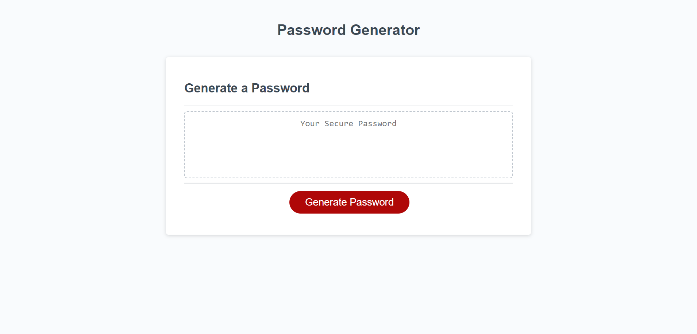
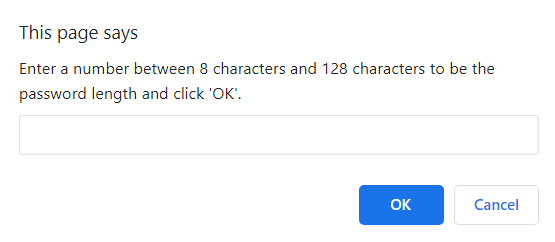
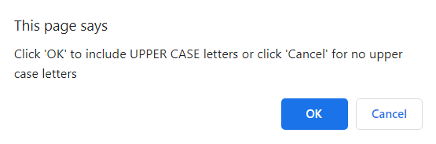
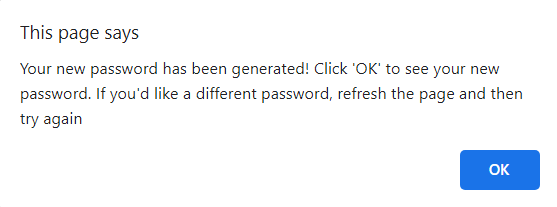
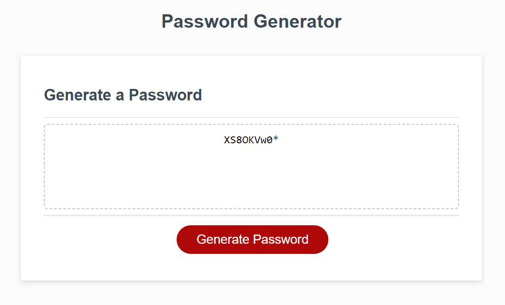

# JS Generate a Password

## Description

The random password generator is the Module 03 challenge for coding bootcamp. I built this project to help anyone who may want a random password generated for their security. I learned a lot more about the use of for loops and Math.random in JavaScript while building this application.

## Installation

No installation required. Link to deployed application provided below:

https://andria-goodwin.github.io/js-generate-a-password/

## Usage

The random password generator features a simple layout with a "Generate" button that can be pressed to trigger prompts for user input. Once the input is collected, a random password will be generated according to the criteria the user provided. There will always be at least one character of each type that was confirmed by the user.

The first prompt will ask the user to provide a desired number of characters between 8 and 128.

The next four prompts will ask which types of characters to include. The user should click 'OK' to include character types and 'Cancel' to exclude them.

There will then be an alert letting the user know that their password has been generated. It also tells them that if they want to try again they need to refresh the page.

After clicking 'OK' on the alert, the generated random password will be displayed in the text box.

## Credits

YouTube. (2021). Homework Startup Guide - Javascript Password Generator. YouTube. Retrieved October 4, 2023, from https://www.youtube.com/watch?v=x4HUaiazDes. 

## License

Please refer to the LICENSE in the repo.